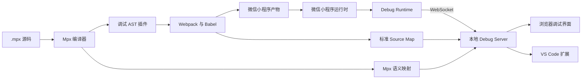

# Mpx 源码级跨端调试器技术方案

> 文档状态：草案 1.0  
> 产品暂定名：Mpx DevTools  
> 首期目标平台：微信小程序  
> 后续目标平台：React Native（iOS、Android、HarmonyOS）

## 1. 背景

Mpx 项目会把同一份 `.mpx` 源码转换为微信小程序代码或 React Native Bundle。经过模板拆分、条件编译、Mpx Loader、Babel、Webpack、平台运行时包装后，最终执行的代码和开发者编写的源码存在较大差异。

当前调试存在以下主要问题：

- 微信开发者工具展示的是编译产物，难以定位到原始 `.mpx` 源码。
- 模板事件、生命周期、`computed`、`watch` 和 `setData` 等框架语义在产物中被包装。
- 手工添加 `debugger` 后需要重新编译并刷新微信开发者工具。
- 大量日志和 Source Map 会增加微信开发者工具的负担。
- 发生问题时只能看到错误位置，无法同时看到页面、组件、参数、变量和状态变化。
- 复杂页面中的组件层级、`data`、`props` 和 `computed` 分散在多个运行时实例中，缺少以源码文件为入口的统一查看方式。
- 为定位一个具体状态值，开发者往往只能在日志和代码中反复搜索，不能直接从运行中的组件状态反查来源。
- 微信与 React Native 使用不同的调试工具，缺少统一的源码视角。

本方案要构建的不是微信开发者工具替代品，而是一个面向 Mpx 的源码级跨端调试层。

## 2. 目标

### 2.1 核心目标

Mpx DevTools 应当回答以下问题：

1. 当前运行的是哪个页面和哪个页面实例？
2. 当前页面包含哪些 Mpx 组件？
3. 某个事件由哪个页面、组件和源码位置触发？
4. 事件发生时，函数参数、组件状态和调用栈是什么？
5. 某次状态修改触发了哪些 `setData`、渲染和网络请求？
6. 编译产物中的位置对应原始 `.mpx` 源码的什么位置？
7. 同一份源码在微信和 React Native 中的行为有什么差异？
8. 某个组件实例的 `data`、`props` 和 `computed` 当前分别是什么，并且它来自哪个 `.mpx` 文件？
9. 某个关键字或状态值出现在哪些活动组件中？

### 2.2 MVP 目标

第一版仅支持微信小程序开发模式，并完成：

- 当前页面和页面栈识别。
- 页面组件树展示。
- JavaScript 异常还原到 `.mpx` 源码。
- 生命周期、方法调用和 `setData` 时间线。
- 方法参数、组件状态和调用栈快照。
- `.mpx` 源码与微信生成代码对照。
- 点击事件后打开本地源码。
- 方法级动态 Logpoint。
- 组件检查器：按源码路径查看活动组件实例的 `data`、`props` 和 `computed` 快照。
- 组件状态关键字搜索，并从结果定位到组件实例和源码。

### 2.3 非目标

第一版不实现：

- 替换微信开发者工具的运行、预览和上传能力。
- 任意行真正暂停 JavaScript 引擎。
- 单步进入、单步跳过和单步退出。
- 不经过编译插桩读取任意词法作用域变量。
- 在调试面板中直接修改业务状态。
- 正式环境远程调试。
- 云端账号、数据上传和团队协作。
- 独立 Electron 桌面应用。

## 3. 产品形态

Mpx DevTools 不是单一软件，而是四层组合：

```text
编译插件
  + 轻量运行时 SDK
  + 本地调试服务
  + 浏览器或 VS Code 可视化界面
```

推荐发布以下 npm 包：

```text
@mpxjs/debug-protocol       共享协议和类型
@mpxjs/debug-source-map     Source Map 与语义映射
@mpxjs/debug-babel-plugin   JavaScript 探针插桩
@mpxjs/debug-webpack-plugin Mpx/Webpack 接入
@mpxjs/debug-runtime        跨平台运行时
@mpxjs/debug-server         本地调试服务
@mpxjs/debug-ui             浏览器调试界面
@mpxjs/debug-vscode         VS Code 扩展
@mpxjs/debug-cli            启动命令
```

第一阶段只交付浏览器界面。VS Code 扩展复用相同的 UI 和 Server API。独立桌面应用只有在后续需要统一管理设备、模拟器和构建流程时再评估。

## 4. 总体架构



各层职责如下：

| 层       | 职责                                         |
| -------- | -------------------------------------------- |
| 编译插件 | 保存转换来源、插入探针、生成构建清单         |
| Runtime  | 采集页面、组件、参数、状态、异常和调用链     |
| Server   | 管理会话、还原源码、保存时间线、转发控制命令 |
| UI       | 展示页面栈、设备画面、组件树、时间线和变量   |

## 5. 技术栈

| 模块        | 推荐技术                                               |
| ----------- | ------------------------------------------------------ |
| 语言        | TypeScript                                             |
| Monorepo    | pnpm workspace                                         |
| 构建接入    | Webpack Plugin API、webpack-chain                      |
| AST         | `@babel/parser`、`@babel/traverse`、`@babel/types`     |
| Source Map  | `@jridgewell/trace-mapping`、`@jridgewell/gen-mapping` |
| 本地服务    | Node.js、Fastify                                       |
| 实时通信    | `ws`                                                   |
| 协议校验    | Zod                                                    |
| 日志        | Pino                                                   |
| Web UI      | React、Vite、Zustand                                   |
| 代码查看    | Monaco Editor                                          |
| 长列表      | 虚拟列表；高数据量时使用 Canvas                        |
| VS Code     | Extension API、Webview                                 |
| 持久化      | MVP 使用内存环形缓冲；后续使用 SQLite                  |
| 单元测试    | Vitest                                                 |
| UI E2E      | Playwright                                             |
| Node 包构建 | tsup 或 esbuild                                        |

第一阶段不引入 Electron、GraphQL、微服务、云数据库和分布式追踪系统。

## 6. 仓库结构

```text
mpx-devtools/
├── packages/
│   ├── protocol/
│   ├── source-mapping/
│   ├── babel-plugin/
│   ├── webpack-plugin/
│   ├── runtime/
│   ├── server/
│   ├── ui/
│   ├── vscode/
│   └── cli/
├── examples/
│   ├── wx-minimal/
│   ├── wx-complex/
│   └── rn-minimal/
├── tests/
│   ├── fixtures/
│   ├── mapping/
│   └── performance/
└── docs/
```

## 7. 启动流程

用户执行：

```bash
npx mpx-debug serve --target wx
```

CLI 执行以下步骤：

1. 读取当前 Mpx 项目配置。
2. 检查 Mpx、Webpack、Node.js 和插件版本。
3. 选择本地服务端口。
4. 生成本次会话使用的随机 Token。
5. 启动 Debug Server。
6. 设置 `MPX_DEBUG=true` 和 Server 地址。
7. 启动原有 `mpx-cli-service serve`。
8. 编译插件注入 Debug Runtime。
9. 打开浏览器调试面板。
10. 等待微信开发者工具或真机运行实例连接。

调试服务默认只监听 `127.0.0.1`。需要真机连接时，由用户显式开启局域网监听。

## 8. 编译接入方案

### 8.1 接入形式

Mpx CLI 已支持通过 `chainWebpack` 修改配置。第一版通过独立 Webpack 插件接入，不创建新的构建系统。

```js
// mpx.config.js
const { defineConfig } = require('@vue/cli-service');
const { MpxDebugPlugin } = require('@mpxjs/debug-webpack-plugin');

module.exports = defineConfig({
  chainWebpack(config) {
    if (process.env.MPX_DEBUG === 'true') {
      config.plugin('mpx-debug').use(MpxDebugPlugin, [
        {
          target: process.env.MPX_TARGET || 'wx',
          serverPort: 4399
        }
      ]);
    }
  }
});
```

### 8.2 Source Map 策略

调试模式优先使用：

```js
config.devtool('hidden-source-map');
```

原因：

- 小程序不能使用 `eval-*` Source Map。
- 微信开发者工具不需要加载全部映射文件。
- Debug Server 可以独立完成堆栈还原。
- 可以降低微信开发者工具的内存和渲染压力。

完整映射链可能为：

```text
.mpx script block
→ Mpx Loader
→ TypeScript
→ Babel
→ 调试探针转换
→ Webpack Bundle
```

每个转换阶段必须接收上一步 `inputSourceMap` 并输出新 Source Map，同时保留 `sourcesContent`。

### 8.3 构建身份

每次构建生成唯一 `buildId`：

```text
target + 配置哈希 + 入口哈希 + 编译序号
```

运行时事件必须携带 `buildId`。当微信运行实例仍在运行旧产物时，Server 必须拒绝用新 Source Map 映射旧事件，并提示用户刷新。

### 8.4 构建清单

```ts
interface DebugBuildManifest {
  protocolVersion: number;
  buildId: string;
  target: 'wx' | 'ios' | 'android' | 'harmony';
  createdAt: number;
  files: Record<
    string,
    {
      sourceId: string;
      contentHash: string;
      outputs: string[];
      sourceMaps: string[];
    }
  >;
}
```

调试资产输出到：

```text
dist/.mpx-debug/
├── manifest.json
├── semantic-map.json
├── source-map-index.json
└── maps/
```

## 9. Mpx 语义映射

标准 Source Map 不能完整描述模板节点、事件、组件、生命周期、`computed` 和 `watch`。因此需要补充语义映射。

### 9.1 语义类型

```ts
type SemanticKind =
  | 'page'
  | 'component'
  | 'template-node'
  | 'event-handler'
  | 'method'
  | 'lifecycle'
  | 'computed'
  | 'watch'
  | 'set-data'
  | 'render';
```

### 9.2 映射结构

```ts
interface SemanticEntry {
  id: string;
  kind: SemanticKind;
  name?: string;
  parentId?: string;
  source: {
    file: string;
    start: { line: number; column: number };
    end: { line: number; column: number };
  };
  generated?: Array<{
    target: string;
    file: string;
    start?: { line: number; column: number };
    end?: { line: number; column: number };
  }>;
}
```

### 9.3 稳定 ID

探针和语义实体 ID 不能依赖行号，否则在文件顶部增加一行就会导致所有 Logpoint 失效。

建议使用：

```text
hash(
  相对文件路径
  + 语义类型
  + 所属页面或组件
  + 方法名或模板结构路径
  + 局部 AST 指纹
)
```

AST 指纹需要忽略空白、注释和行号。

### 9.4 模板映射

模板映射是首要技术风险。正式实现应尽量由 Mpx 模板编译器输出调试元数据：

```ts
interface TemplateDebugHook {
  onNode(node: TemplateNode): void;
  onExpression(expression: ExpressionNode): void;
  onEvent(event: EventBinding): void;
}
```

若第一阶段无法修改 Mpx 核心，可以独立解析模板块并记录模板路径，但此方案只能作为 POC，不应作为长期正式实现。

## 10. 页面识别

调试器不使用截图推测当前页面。页面身份来自运行时：

- `getCurrentPages()` 页面栈。
- Page 创建、`onLoad`、`onShow`、`onHide`、`onUnload`。
- 页面 route。
- 每次页面实例化时生成的 `pageInstanceId`。
- 页面实例与根组件实例的关联关系。

页面状态定义为：

```ts
type PageState = 'visible' | 'hidden' | 'unloaded';
```

页面模型：

```ts
interface DebugPageInstance {
  pageInstanceId: string;
  route: string;
  title?: string;
  state: PageState;
  stackIndex: number;
  createdAt: number;
  shownAt?: number;
  hiddenAt?: number;
  unloadedAt?: number;
  rootComponentId?: string;
}
```

UI 左侧显示页面栈，并明确标识：

- 当前页面
- 上一页
- 后台隐藏页面
- 已卸载但仍保留调试记录的页面

## 11. 组件树

每个 Mpx 组件实例需要生成运行期 `componentInstanceId`，并关联：

- `pageInstanceId`
- 父组件实例
- 源文件 `sourceId`
- 组件名称
- 创建与销毁时间
- props 和 data 摘要

```ts
interface DebugComponentInstance {
  componentInstanceId: string;
  pageInstanceId: string;
  parentComponentId?: string;
  sourceId: string;
  name: string;
  createdAt: number;
  destroyedAt?: number;
}
```

组件树第一版只读，不允许直接修改状态。

### 11.1 组件检查器与状态搜索

现有轻量级 Mpx DevTools 的实践证明，开发者最先需要的是：无需修改业务代码，就能查看当前页面的活动组件、其来源文件以及 `data`、`props`、`computed`。本方案将该能力作为组件树的直接补充，而不是只显示名称和层级。

组件检查器应遵循以下原则：

- 按当前 `pageInstanceId` 隔离活动实例，避免已离开页面或其他页面的状态混入结果。
- 每个实例显示 `componentInstanceId`、组件类型、父实例、源码相对路径和创建时间。
- 选择实例时按需采集最新的 `data`、`props`、`computed` 摘要；不能长期持有业务对象引用。
- 搜索范围仅限这三类公开状态，返回匹配值、字段路径、组件实例和源码位置。
- 搜索结果必须可一键选中组件、打开源码并过滤时间线。
- 第一版保持只读；临时修改运行时状态属于后续受控实验能力，必须显式启用、记录审计事件，并复用安全序列化与脱敏规则。

建议的查询结果结构：

```ts
interface ComponentStateSearchHit {
  pageInstanceId: string;
  componentInstanceId: string;
  sourceId: string;
  sourceFile: string;
  stateKind: 'data' | 'props' | 'computed';
  path: string;
  value: SerializedValue;
  capturedAt: number;
}
```

## 12. 探针插桩

### 12.1 默认探针

默认只插入低风险边界探针：

- 方法入口。
- 页面和组件生命周期入口。
- 事件处理器入口。
- 异常边界。
- `setData` 统一调用入口。
- 网络请求统一入口。

入口插桩示例：

```js
async submitOrder(order) {
  __MPX_DEBUG__.hit('probe_e7192c', this, arguments)
  this.loading = true
  return api.submit(order)
}
```

第一版不包装所有 `return`，避免改变 async、生成器、`this`、`arguments` 和异常行为。

### 12.2 动态 Logpoint

编译时预留方法级探针，默认关闭采集。UI 开启 Logpoint 时通过 WebSocket 发送控制命令，不重新编译。

动态开启后可以采集：

- 参数。
- `this` 摘要。
- 组件状态。
- 调用栈。
- 返回值摘要，前提是该方法已启用返回值包装。

### 12.3 局部变量

运行时无法凭空读取尚未暴露的词法局部变量。任意局部变量需要 AST 插桩：

```js
const coupon = this.selectedCoupon;
const finalPrice = calculatePrice(order, coupon);

__MPX_DEBUG__.snapshot('probe_abc', {
  coupon,
  finalPrice,
  order
});
```

因此提供两种模式：

| 模式            |     是否需要重新编译 | 能力                     |
| --------------- | -------------------: | ------------------------ |
| 方法级 Logpoint |                   否 | 参数、this、状态、调用栈 |
| 行级数据探针    | 首次需要局部增量编译 | 当前作用域内指定变量     |

### 12.4 条件探针

第一版禁止运行时 `eval`，使用结构化条件 DSL：

```ts
type ProbeCondition =
  | { path: string; operator: 'eq' | 'neq'; value: unknown }
  | { path: string; operator: 'gt' | 'gte' | 'lt' | 'lte'; value: number }
  | { path: string; operator: 'contains'; value: string }
  | { all: ProbeCondition[] }
  | { any: ProbeCondition[] };
```

## 13. 参数、变量和状态快照

事件详情应至少包含：

```text
参数 | 局部变量 | 组件状态 | 调用栈 | 返回值 | 异常
```

### 13.1 快照而不是引用

采集时必须序列化为当时的快照，不能只保存可变对象引用。

```ts
interface VariableSnapshot {
  snapshotId: string;
  capturedAt: number;
  probeId: string;
  arguments?: Record<string, SerializedValue>;
  locals?: Record<string, SerializedValue>;
  componentState?: Record<string, SerializedValue>;
  returnValue?: SerializedValue;
  error?: SerializedValue;
}
```

### 13.2 安全序列化

序列化器必须处理：

- 循环引用。
- getter 副作用。
- 函数和原生对象。
- 超大数组和字符串。
- 不可序列化属性。
- 敏感字段。

默认限制：

```text
最大深度：4
单对象最大属性数：100
数组最大元素数：100
字符串最大长度：2 KB
单变量最大体积：32 KB
单快照最大体积：128 KB
```

默认脱敏字段包括：

```text
password、passwd、token、authorization、cookie、secret、session
```

### 13.3 状态差异

对组件状态优先展示差异：

```diff
- loading: false
+ loading: true

- order.status: "pending"
+ order.status: "submitting"
```

## 14. Runtime 设计

### 14.1 核心接口

```ts
interface MpxDebugRuntime {
  initialize(config: RuntimeConfig): void;
  emit(event: RuntimeEvent): void;
  hit(probeId: string, thisValue: unknown, args: IArguments): void;
  snapshot(probeId: string, values: Record<string, unknown>): void;
  captureError(error: unknown, context?: unknown): void;
  updateProbeConfig(config: ProbeConfig): void;
  dispose(): void;
}
```

### 14.2 运行时流水线

```text
框架事件
→ 探针事件
→ 数据脱敏
→ 安全序列化
→ 采样与合并
→ 内存队列
→ WebSocket 批量上报
```

### 14.3 微信传输适配器

使用 `wx.connectSocket`，实现：

- 首次握手。
- 断线重连。
- 前后台切换。
- 批量发送。
- 队列溢出处理。
- 关键事件优先级。

建议默认参数：

```text
最大队列：1,000 条
每批最多：50 条
刷新间隔：50ms
单批最大：64 KB
普通事件最长保留：5 秒
```

调试服务不可用时，Runtime 不能阻塞或影响业务执行。

### 14.4 事件优先级

```ts
enum EventPriority {
  Critical = 0,
  High = 1,
  Normal = 2,
  Low = 3
}
```

队列满时优先丢弃渲染和高频状态事件，不能丢弃错误、构建不匹配和用户设置的 Logpoint 命中事件。

## 15. 调试协议

### 15.1 通用事件

```ts
interface DebugEvent {
  protocolVersion: number;
  eventId: string;
  sessionId: string;
  buildId: string;
  target: 'wx' | 'ios' | 'android' | 'harmony';
  timestamp: number;
  priority: EventPriority;
  type:
    | 'page'
    | 'component'
    | 'lifecycle'
    | 'method'
    | 'state'
    | 'setData'
    | 'network'
    | 'error'
    | 'render'
    | 'probe';
  pageInstanceId?: string;
  componentInstanceId?: string;
  semanticId?: string;
  probeId?: string;
  payload?: unknown;
}
```

### 15.2 会话握手

```json
{
  "type": "session.hello",
  "protocolVersion": 1,
  "token": "random-debug-token",
  "buildId": "wx-build-001",
  "target": "wx",
  "runtime": "wechat-devtools"
}
```

Server 校验协议版本、Token、`buildId` 和目标平台。

### 15.3 探针控制

```json
{
  "type": "probe.update",
  "requestId": "req-17",
  "probeId": "probe-e7192c",
  "enabled": true,
  "capture": {
    "arguments": true,
    "componentState": true,
    "stack": true
  }
}
```

## 16. Debug Server

### 16.1 模块划分

```text
Fastify Server
├── REST API
├── WebSocket Gateway
├── Session Manager
├── Build Registry
├── Event Pipeline
├── Source Mapping Service
├── Trace Buffer
└── Static UI Server
```

### 16.2 事件处理

```text
接收 batch
→ Zod 协议校验
→ 会话和 buildId 校验
→ 时间戳校正
→ 去重
→ Source Map 还原
→ 语义实体关联
→ 环形缓冲区
→ 推送 UI
```

### 16.3 REST API

```text
GET  /api/project
GET  /api/builds/current
GET  /api/sessions
GET  /api/pages
GET  /api/components
GET  /api/events
GET  /api/source
GET  /api/generated
POST /api/probes
POST /api/source/open
POST /api/events/clear
POST /api/traces/export
```

### 16.4 环形缓冲区

MVP 只保留最近 10,000 条事件。旧事件自动覆盖。后续可以导出 `.mpx-trace`：

```text
trace.mpx-trace
├── manifest.json
├── events.jsonl
├── semantic-map.json
├── source-maps/
└── snapshots/
```

## 17. 错误堆栈还原

处理步骤：

1. 解析错误 Stack Frame。
2. 根据 `buildId` 找到对应构建。
3. 根据生成文件找到 Source Map。
4. 将生成代码行列映射到 `.mpx`。
5. 使用语义映射补充页面、组件和方法。
6. 默认折叠 Mpx 框架内部调用栈。
7. 保留原始调用栈供展开查看。

还原结果：

```ts
interface ResolvedStackFrame {
  functionName?: string;
  source: {
    file: string;
    line: number;
    column: number;
  };
  generated?: {
    file: string;
    line: number;
    column: number;
  };
  semanticId?: string;
  internal: boolean;
}
```

## 18. 可视化界面

### 18.1 主界面

```text
┌─────────────────────────────────────────────────────────────┐
│ 项目 | wx 已连接 | Build 一致 | 正在记录 | 清空 | 导出     │
├──────────────┬──────────────────────────┬───────────────────┤
│ 页面栈       │ 当前设备画面             │ 当前组件树        │
│              │                          │                   │
│ 订单详情 当前│ 页面标题和路由           │ OrderDetailPage   │
│ 首页     上页│                          │ ├─OrderHeader     │
│ 购物车 已卸载│ 本页面时间线             │ └─SubmitButton    │
├──────────────┼──────────────────────────┼───────────────────┤
│              │ 参数/变量/状态           │ 源码位置          │
│              │                          │ detail.mpx:45     │
└──────────────┴──────────────────────────┴───────────────────┘
```

### 18.2 页面栈

显示：

- 路由。
- 页面标题。
- 当前、隐藏或已卸载状态。
- 页面实例 ID。
- 页面进入时间。
- 该页面未处理错误数。

选择页面后，其他区域只显示属于该 `pageInstanceId` 的组件和事件。

### 18.3 设备画面

MVP 不依赖实时截图，仅显示页面身份、路由和组件结构。后续可选接入微信开发者工具截图，但截图只用于辅助理解，不作为页面身份来源。

### 18.4 时间线

```text
tap
→ method
→ state
→ setData
→ network
→ response
→ render
```

支持按页面、组件、事件类型和时间过滤。点击事件后显示参数、变量、状态、调用栈和源码位置。

### 18.5 源码与产物对照

```text
原始 detail.mpx | 微信 detail.js
原始 detail.mpx | 微信 detail.wxml
```

支持双向滚动、行高亮和语义实体定位。

### 18.6 组件检查器与搜索

选中组件树节点后，右侧状态面板显示该实例的 `data`、`props`、`computed` 三个只读分组，以及组件源码路径和实例 ID。用户可输入关键字搜索当前页面活动组件的状态；每条结果显示“组件源码路径 / 状态类别 / 字段路径 / 值摘要”。选择结果后，UI 选中对应组件、过滤时间线，并提供打开源码入口。

这条交互链路优先解决日常的“值从哪里来、现在在哪个组件里、对应哪份源码”问题；它不依赖暂停、单步或实时截图，因此可作为源码级探针能力完成前的早期可用功能。

## 19. 打开源码

浏览器 UI 请求：

```http
POST /api/source/open
```

```json
{
  "file": "src/pages/order/detail.mpx",
  "line": 45,
  "column": 18
}
```

Server 必须验证：

- 文件必须位于项目根目录。
- 禁止 `../` 路径穿越。
- 文件必须存在。
- 文件扩展名必须在允许列表中。

验证后调用编辑器打开能力。

## 20. VS Code 集成

浏览器版稳定后增加 VS Code 扩展：

- 打开时间线 Webview。
- 点击事件跳转 `.mpx` 源码。
- 行号旁显示可设置探针的位置。
- 添加或删除方法级 Logpoint。
- Problems 面板显示运行时错误。
- 显示构建和设备连接状态。

第一阶段不实现 Debug Adapter Protocol，避免用户误以为支持真正暂停和单步执行。

## 21. React Native 扩展

RN 阶段复用以下上层能力：

- 调试协议。
- 页面、组件和语义模型。
- Debug Server。
- UI。
- Trace 格式。

新增：

- Metro Source Map 适配。
- Hermes 调用栈还原。
- RN WebSocket Transport。
- RN 页面和组件适配器。
- 微信与 RN 时间线对比。

RN Source Map 必须与实际 Bundle 精确匹配，因此继续使用 `buildId` 进行严格校验。

## 22. 配置

```ts
interface MpxDebugOptions {
  enabled?: boolean;
  target?: 'wx' | 'ios' | 'android' | 'harmony';
  server?: {
    host?: string;
    port?: number;
    open?: boolean;
  };
  probes?: {
    lifecycle?: boolean;
    methods?: boolean;
    setData?: boolean;
    network?: boolean;
    render?: boolean;
  };
  capture?: {
    arguments?: boolean;
    componentState?: boolean;
    stack?: boolean;
    maxDepth?: number;
    maxEventBytes?: number;
  };
  redact?: Array<string | RegExp>;
  include?: Array<string | RegExp>;
  exclude?: Array<string | RegExp>;
}
```

默认采用低开销配置：

```js
{
  enabled: false,
  probes: {
    lifecycle: true,
    methods: true,
    setData: true,
    network: true,
    render: false
  },
  capture: {
    arguments: false,
    componentState: false,
    stack: false,
    maxDepth: 3,
    maxEventBytes: 65536
  }
}
```

## 23. 性能预算

| 指标                   |           目标 |
| ---------------------- | -------------: |
| 首次编译额外耗时       |       小于 15% |
| 增量编译额外耗时       |       小于 10% |
| 未命中探针运行时开销   |        小于 2% |
| 默认调试 Runtime 体积  |    小于 100 KB |
| 单批事件体积           |     小于 64 KB |
| UI 流畅处理事件数      | 至少 10,000 条 |
| 业务 JS 源码映射正确率 |       大于 99% |
| 生产构建调试代码残留   |              0 |

## 24. 安全与隐私

- 默认只监听本机地址。
- 真机连接必须显式开启局域网监听。
- 每次启动生成随机 Token。
- 所有运行时消息进行协议校验。
- 源码和调试数据默认不上传网络。
- 敏感字段默认脱敏。
- 打开源码接口必须限制在项目根目录。
- 条件探针禁止 `eval`。
- 生产构建必须有自动化测试验证无调试代码残留。

## 25. 测试策略

### 25.1 Source Map 黄金测试

建立固定 fixture：

```text
basic-method.mpx
async-method.mpx
typescript.mpx
conditional-compile.mpx
template-event.mpx
computed-watch.mpx
```

每个 fixture 验证生成代码行列是否能还原到预期 `.mpx` 行列。

### 25.2 AST 语义测试

验证插桩后：

- `this` 不变。
- `arguments` 不变。
- 返回值不变。
- async 行为不变。
- 异常继续抛出。
- 注释和 Source Map 保留。
- 生产构建没有 Runtime 引用。

### 25.3 协议测试

覆盖：

- 协议版本不一致。
- `buildId` 不一致。
- Token 错误。
- 非法消息。
- 超大消息。
- 断线重连。
- 重复事件。
- 事件乱序。

### 25.4 性能测试

至少准备 30、300 和 1,000 个组件规模的样例项目，并记录编译耗时、运行时耗时、内存和 UI 帧率。

## 26. 技术风险

| 风险                         | 影响                   | 应对                            |
| ---------------------------- | ---------------------- | ------------------------------- |
| 多阶段 Source Map 丢失       | 无法准确定位源码       | 每阶段验证 map，并建立黄金测试  |
| 模板映射无法从外围获得       | 模板事件无法准确定位   | 为 Mpx 编译器增加调试元数据钩子 |
| 插桩改变业务语义             | 引入新的错误           | 默认只插函数入口，逐步扩大范围  |
| 微信真机无法连接本机         | 真机调试不可用         | 局域网、adb/iOS 端口转发或代理  |
| 高频事件造成卡顿             | 调试器反而降低开发效率 | 批处理、采样、优先级和环形缓冲  |
| 大对象泄露敏感信息           | 隐私和安全风险         | 限深、限长、脱敏、默认不采参数  |
| 运行实例与 Source Map 不匹配 | 映射到错误源码         | 强制校验 `buildId`              |

## 27. 分阶段交付

### 阶段 0：技术验证

验证一条完整链路：

```text
点击按钮
→ 方法探针命中
→ Runtime 上报
→ Server 接收
→ Source Map 映射
→ 显示 detail.mpx:45
→ 点击打开源码
```

### 阶段 1：微信 MVP

完成页面栈、组件树、异常、方法、生命周期、`setData`、参数快照、时间线和源码定位。

### 阶段 2：可用性增强

增加动态 Logpoint、条件探针、状态差异、网络面板、源码产物对照和 VS Code 扩展。

### 阶段 3：React Native

增加 Metro/Hermes 适配和多端行为对比。

### 阶段 4：高级能力

评估行级数据探针、Trace 回放、性能火焰图、DAP 和独立桌面端。

## 28. 架构决策摘要

1. 核心能力放在编译插件和 Runtime，不放在 UI。
2. 第一版使用浏览器界面，不开发 Electron。
3. 页面身份来自运行时页面栈，不来自截图识别。
4. Source Map 和 Mpx 语义映射同时存在。
5. 默认只插入函数边界探针。
6. 方法级 Logpoint 动态开关；任意局部变量使用局部增量编译。
7. 条件探针不使用 `eval`。
8. MVP 使用内存环形缓冲，不引入数据库。
9. 调试数据默认仅在本机处理。
10. 每个实现迭代只交付一个可独立验收的功能点。
